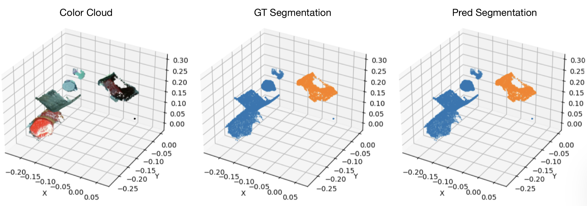
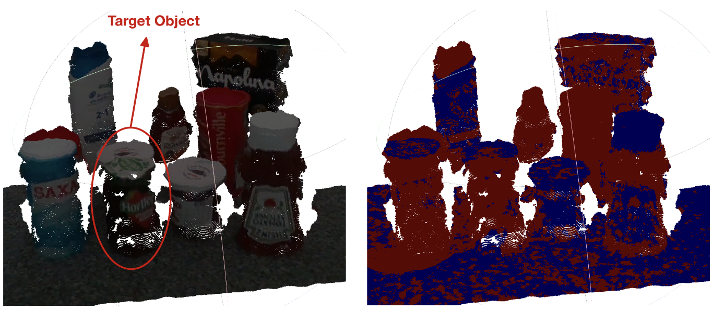

# DGCNN (PyTorch) — MiniMarket Semantic Segmentation

Dynamic Graph CNN (DGCNN) implemented in PyTorch for 3D point‑cloud **semantic segmentation** (object vs. background) on MiniMarket‑style scenes. Train on HDF5 datasets and run inference on raw `.pcd` scenes.

---

## Quick Start

### 1) Environment
Create and activate the conda environment from the provided YAML:

```bash
# clone the repo
git clone https://github.com/Saravut-Lin/dgcnn.pytorch.git
cd dgcnn.pytorch

# create and activate the environment
conda env create -f dgcnn_env.yml
conda activate dgcnn   # or the name defined inside the YAML
```

---

### 2) Dataset
Generate the dataset using the **MiniMarket dataset processing** repo, then copy the produced HDF5 into this repo’s `dataset/` folder.

```bash
git clone https://github.com/msorour/MiniMarket_dataset_processing.git
cd MiniMarket_dataset_processing
# Follow that repo's instructions to produce the .h5 /.hdf5 file
```

Place the generated file here:

```text
dgcnn.pytorch/
└─ dataset/
   └─ market_semseg.h5    # ← your generated file (name is up to you)
```

> If you use a different path/filename, adjust the corresponding argument or constant in the training script.

---

### 3) Train
Run the MiniMarket semantic‑segmentation training script:

```bash
python main_semseg_market.py
# optional: view flags
python main_semseg_market.py -h
```

The script logs metrics and saves checkpoints; **note the best checkpoint path** (e.g., best epoch ~85 in our runs).

---

### 4) Inference on real‑world scenes (`.pcd`)
Use your saved checkpoint to run inference on a PCD file. Example PCDs live under **`segmentation/realworld_scene/`**.

```bash
python dgcnn_inference.py \
    --checkpoint /home/s2671222/dgcnn.pytorch/outputs/market77_optim/models/best_model.pth \
    --input_pcd /home/s2671222/dgcnn.pytorch/segmentation/realworld_scene/realworld_scene_1.pcd \
    --output_ply /home/s2671222/dgcnn.pytorch/segmentation/results/dgcnn_segment/scene_segmented1_dgcn_best_1.ply \
    --grid_size 0.389 \
    --overlap 0.3
```

The inference utility removes invalid/NaN points, can chunk large clouds with voting, and writes/visualizes the predicted segmentation (object vs. background).

---

## Results

### Training performance (100 epochs)
- Loss: **1.08 → ~0.024**
- Overall accuracy: **65.8% → 99.8%**
- mIoU: **0.42 → 0.987**
- Dual‑loss objective (weighted cross‑entropy + Dice) proved effective:
  - background IoU: **0.997**
  - object IoU: **0.974**
- Smooth, monotonic descent with cosine‑annealed LR; **epoch 85** selected as best checkpoint.

### Validation performance
- Accuracy: **63% → 99.7%**
- Best mIoU: **0.985** (epoch 85)
- Class IoU (final): background **0.997**, object **0.970**
- Train/val curves almost overlap after epoch 30 (gap ≤ **0.003**), suggesting minimal overfitting despite ~1:9 foreground/background.

**Qualitative test example (best epoch 85)** — object (orange) vs. background (blue):



### Real‑world PCD inference (10 scenes)
- Valid points per scene after NaN removal: **~222k–371k**
- Fraction predicted as target: **36.8–56.6%** (mean **~49%**)
- Typical behavior: correctly localizes the object region but **boundaries can be coarse**, with some leakage onto neighboring cylindrical items in tightly packed shelves.



---

## Repository Layout

```text
dgcnn.pytorch/
├─ main_semseg_market.py        # training entry point (MiniMarket semantic segmentation)
├─ dgcnn_inference.py           # inference on real-world PCDs
├─ dgcnn_env.yml                # conda environment
├─ dataset/                     # place your generated HDF5 file here
├─ segmentation/
│  └─ realworld_scene/          # example PCD scenes for inference
├─ checkpoints/                 # (optional) saved models
└─ image/                       # figures used in this README
```

---

## Tips & Troubleshooting
- **CUDA / memory:** reduce batch size or neighborhood size `k` if you hit OOM.
- **PCD ingest:** ensure `.pcd` files are valid; the inference script removes invalid points but cannot fix corrupted files.
- **Paths:** double‑check dataset and checkpoint paths and CLI arguments.

---

## Acknowledgments
- **Model:** Dynamic Graph CNN (DGCNN) for learning on point clouds (Wang *et al.*).
- **Dataset preparation:** [MiniMarket_dataset_processing](https://github.com/msorour/MiniMarket_dataset_processing).

---

## License
See the repository’s `LICENSE` file.

---

## Citation
If you use this code or results, please cite:

```bibtex
@article{wang2019dynamic,
  title   = {Dynamic Graph CNN for Learning on Point Clouds},
  author  = {Wang, Yue and Sun, Yongbin and Liu, Ziwei and Sarma, Sanjay E. and Bronstein, Michael M. and Solomon, Justin M.},
  journal = {ACM Transactions on Graphics},
  year    = {2019}
}
```

---

## Reproduction checklist
- [x] `conda env create -f dgcnn_env.yml && conda activate dgcnn`
- [x] Generate HDF5 with `MiniMarket_dataset_processing` → place in `./dataset`
- [x] `python main_semseg_market.py` → note best checkpoint (e.g., epoch 85)
- [x] `python dgcnn_inference.py --ckpt <best.pth> --pcd segmentation/realworld_scene/<scene>.pcd`
